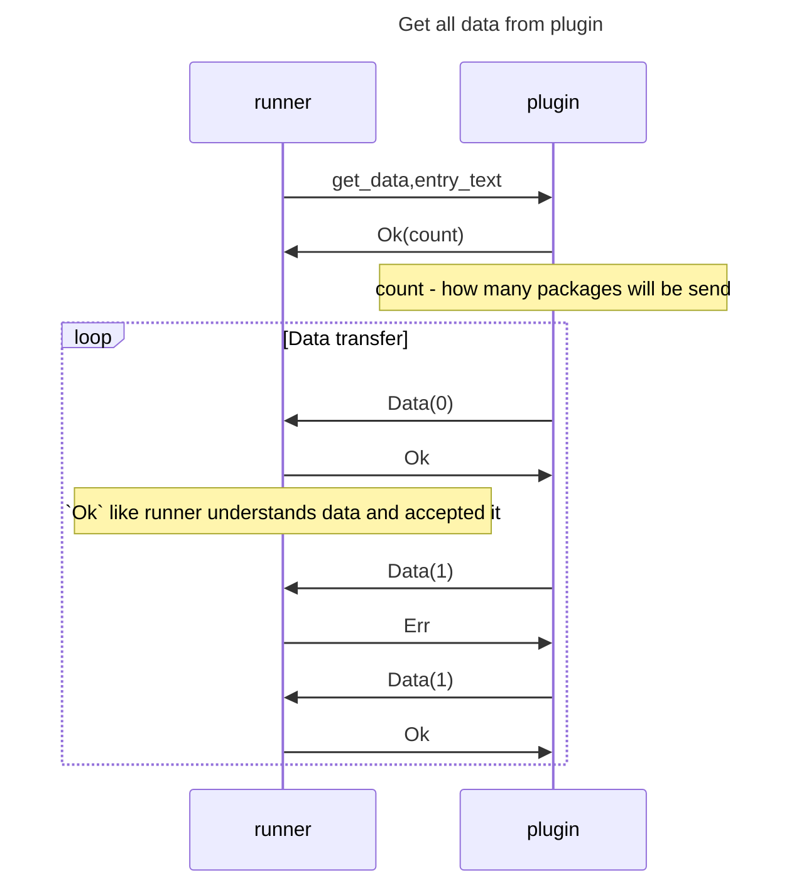
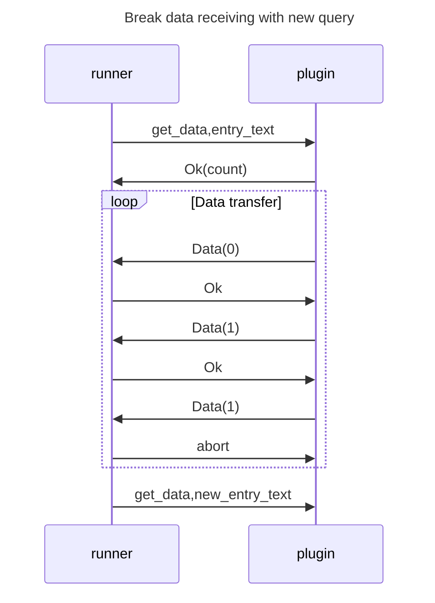
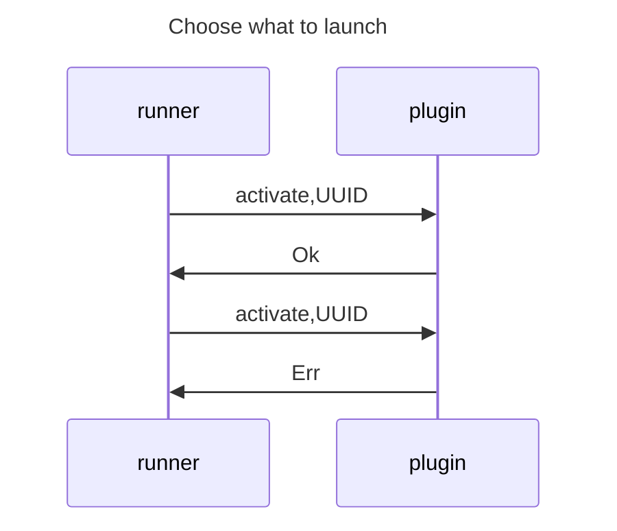

#

```mermaid
sequenceDiagram
    title Get all data from plugin
    participant runner
    participant plugin

    runner ->> plugin: get_data,entry_text
    plugin ->> runner: Ok(count)
    Note over plugin: count - how many packages will be send
    loop Data transfer
        plugin ->> runner: Data(0)
        runner ->> plugin: Ok
        Note over runner: `Ok` like runner understands data and accepted it
        plugin ->> runner: Data(1)
        runner ->> plugin: Err
        plugin ->> runner: Data(1)
        runner ->> plugin: Ok
    end
```

```mermaid
sequenceDiagram
    title Break data receiving with new query
    participant runner
    participant plugin

    runner ->> plugin: get_data,entry_text
    plugin ->> runner: Ok(count)
    loop Data transfer
        plugin ->> runner: Data(0)
        runner ->> plugin: Ok
        plugin ->> runner: Data(1)
        runner ->> plugin: Ok
        plugin ->> runner: Data(1)
        runner ->> plugin: abort
    end
        runner ->> plugin: get_data,new_entry_text
```

```mermaid
sequenceDiagram
    title Choose what to launch
    participant runner
    participant plugin

    runner ->> plugin: activate,UUID
    plugin ->> runner: Ok
    runner ->> plugin: activate,UUID
    plugin ->> runner: Err
```
