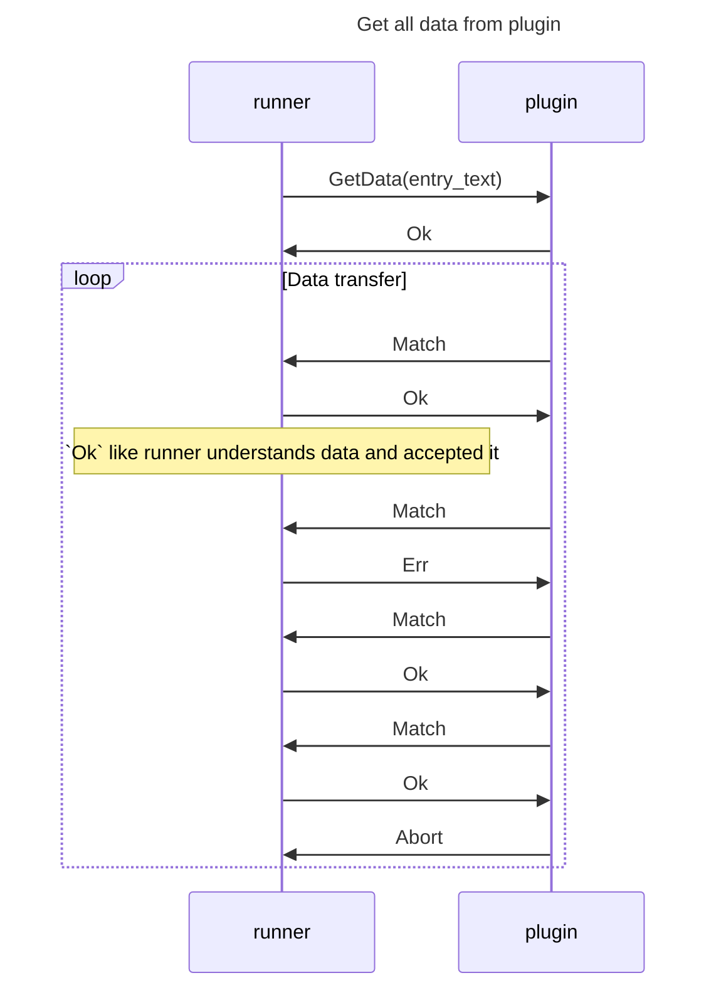
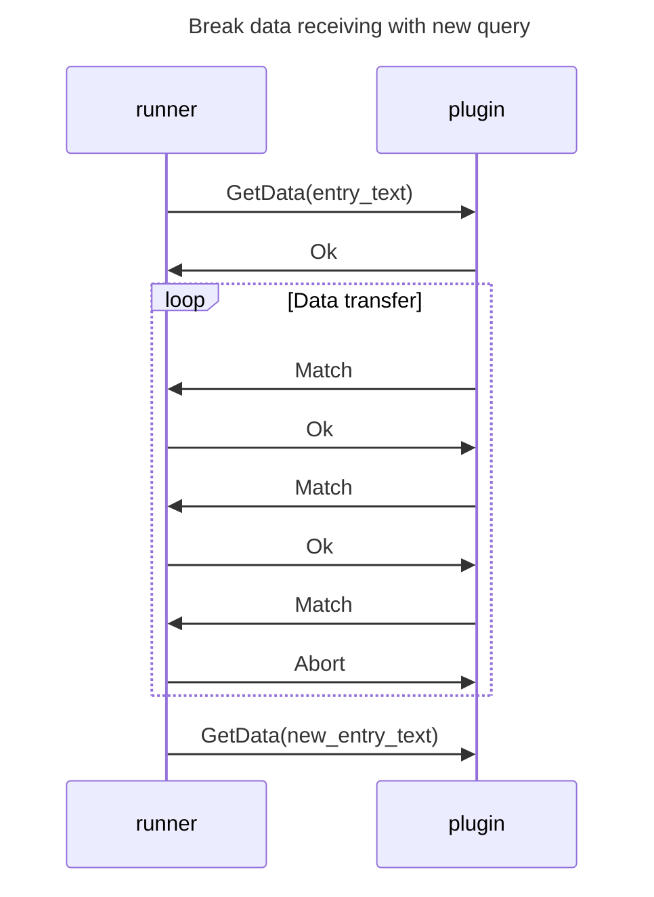
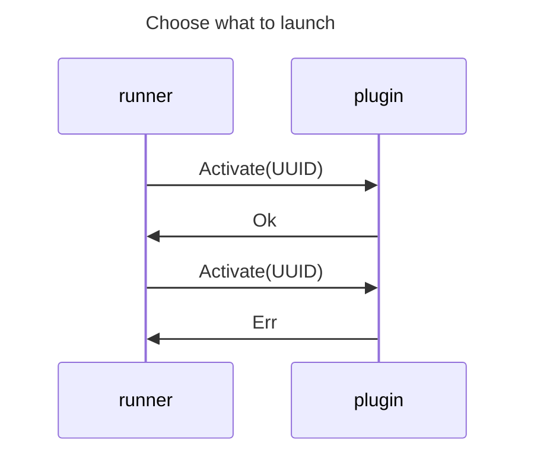

#

<!-- TODO add Abort answer? -->

```mermaid
sequenceDiagram
    title Get all data from plugin
    participant runner
    participant plugin

    runner ->> plugin: GetData(entry_text)
    plugin ->> runner: Ok
    loop Data transfer
        plugin ->> runner: Match
        runner ->> plugin: Ok
        Note over runner: `Ok` like runner understands data and accepted it
        plugin ->> runner: Match
        runner ->> plugin: Err
        plugin ->> runner: Match
        runner ->> plugin: Ok
        plugin ->> runner: Match
        runner ->> plugin: Ok
        plugin ->> runner: Abort
    end
```

```mermaid
sequenceDiagram
    title Break data receiving with new query
    participant runner
    participant plugin

    runner ->> plugin: GetData(entry_text)
    plugin ->> runner: Ok
    loop Data transfer
        plugin ->> runner: Match
        runner ->> plugin: Ok
        plugin ->> runner: Match
        runner ->> plugin: Ok
        plugin ->> runner: Match
        runner ->> plugin: Abort
    end
    runner ->> plugin: GetData(new_entry_text)
```

```mermaid
sequenceDiagram
    title Choose what to launch
    participant runner
    participant plugin

    runner ->> plugin: Activate(UUID)
    plugin ->> runner: Ok
    runner ->> plugin: Activate(UUID)
    plugin ->> runner: Err
```
