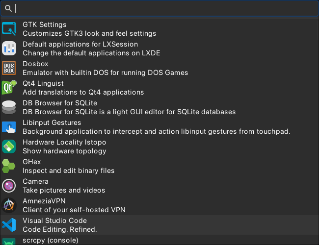

# UniRun

Yet another ~~shameless plug~~ runner appliction.

Highly inspired by [Anyrun](https://github.com/anyrun-org/anyrun) and [Walker](https://github.com/abenz1267/walker).



---

- Rust
- GTK4 with gtk4-layer-shell
- plugins via Unix-sockets to be able to write them in any language that can work with IPC and will communicate with main app by some kind of protocol [NOTES](NOTES.md)

## How to

### Build

```bash
git clone --recursive https://github.com/bzglve/unirun.git
cd unirun
cargo build --release
```

### Install

```bash
# compile and put unirun and plugins to ~/.cargo/bin
cargo install --path unirun
cargo install --path plugins/*
# or you can copy unirun and plaugins binary to whereever dir you want
# cp target/release/unirun{,-plugin-application} ~/.local/bin
```

### Run

```bash
unirun  # if it placed into dir from your $PATH
```

> ![NOTE]
>
> unirun will scan dir where it placed for files matches `unirun-plugin-*` to launch them
>
> so plugin need to be named proper way and placed alongside with unirun binary

## Comments

- yes, code looks terrible [todo](#todo)
- currently only one plugin [todo](#todo)
  - expanding there will be more, but it requires to write good looking messages protocol
  - mostly plugins will be written in rust as I'm currenly don't know how to be better to write common `unirun`-`plugin` parts without rewriting it from rust to for example python (?FFI)
    - but tecnically it is possible to use anything that works with socket

## TODO

- [ ] Refactor and optimize
- [ ] Configuration
- [ ] Protocol
- [ ] Plugins
- [ ] UI
  - [x] Close on Escape
  - [x] First row selected by default
